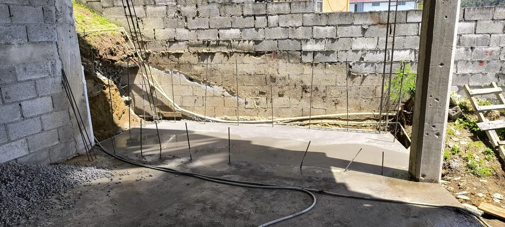

# Brick-O-Lage Construction Website

A simple static portfolio website for Brick-O-Lage Construction, built with HTML, CSS, and JavaScript.

## Overview

This site showcases a modern construction portfolio for a Dominica-based contractor. It includes:

- a home page
- a gallery page with project sections and descriptive captions
- a contact page
- responsive navigation and layout
- image-based portfolio sections for construction, masonry, foundations, and finishes

## Preview

Home page sample:

Gallery page sample:

## Project Structure

- `index.html` — home page
- `gallery.html` — portfolio gallery with categorized image sections
- `contact.html` — contact page
- `styles.css` — main stylesheet
- `script.js` — JavaScript for navigation/mobile menu
- `images/` — gallery and site images
- `css/` — folder for additional CSS if needed
- `js/` — folder for additional JavaScript if needed

## How to Use

1. Open `index.html` in a browser to view the site locally.
2. Use the navigation menu to move between `Home`, `Gallery`, and `Contact`.
3. Add or update images inside the `images/` folder.
4. Update `gallery.html` to change gallery sections or captions.

## Customization

- Edit `styles.css` to change colors, typography, spacing, or responsive breakpoints.
- Add new sections in `gallery.html` by copying a `gallery-section` block.
- Update `script.js` if you want to extend mobile menu behavior or add UI interactions.

## Notes

- The gallery is organized into themed sections such as `Views`, `Building & Renovations`, `Masonry`, `Plumbing & Foundations`, and `Quantity Surveying & Finish Work`.
- Captions are included under each image for improved accessibility and clarity.

## License

This repository is provided as-is for personal or portfolio use.
